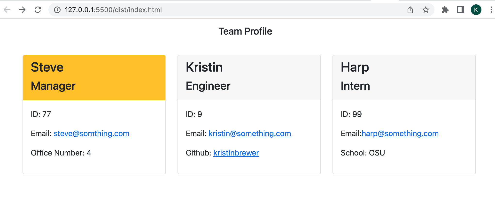

# Team Profile Generator
User will use Node.js to generate HTML webpage to display employee summaries 

## Description
This command-line application allows users to dynamically generate HTML pages with employee information given use of Node.js. When users use the command of ```node index.js``` the application will begin. Users will be prompted to enter the manager's name, ID, email and office number. The user is then presented with a menu to select an addition of an engineer or intern. Both options allow for addtional input. When user is complete, an HTML page is generated with employee information. Unit tests where utilized within the code.



[Video run through of application](https://drive.google.com/file/d/1UsvGXS7bPAt720yV9ofD4EvjBYhHRl5K/view?usp=sharing)

[GitHub Repo](https://github.com/kristinbrewer/team-profile-generator)


## Table of Contents
- [Description](#description)
- [Installation](#installation)
- [Usage](#usage)
- [License](#license)
- [Contributing](#contributing)
- [Tests](#tests)
- [Questions](#questions)

## Installation
Node.js and the inquirer package

## Usage
Initiate index.js via integrated terminal, enter in responses to question prompts, view created HTML.

## License
MIT Copyright (c) 2022 kristinbrewer
Permission is hearby granted, free of charge, to any person obtaining a copy of this software and associated documentation files (the "Software"), to deal in the Software without restriction, including without limitation the rights to use, copy, modify, merge, publish, distribute, sublicense, and/or sell copies of the Software, and to permit persons to whom the Software is furnished to do so, subject to the following conditions: The above copyright notice and this permission notice shall be included in all copies or substantial portions of the Software. THE SOFTWARE IS PROVIDED ”AS IS”, WITHOUT WARRANTY OF ANY KIND, EXPRESS OR IMPLIED, INCLUDING BUT NOT LIMITED TO THE WARRANTIES OF MERCHANTABILITY, FITNESS FOR A PARTICULAR PURPOSE AND NONINFRINGEMENT. IN NO EVENT SHALL THE AUTHORS OR COPYRIGHT HOLDERS BE LIABLE FOR ANY CLAIM, DAMAGES OR OTHER LIABILITY, WHETHER IN AN ACTION OF CONTRACT, TORT OR OTHERWISE, ARISING FROM, OUT OF OR IN CONNECTION WITH THE SOFTWARE OR THE USE OR OTHER DEALINGS IN THE SOFTWARE. 

## Contributing
Kristin Brewer

## Tests
Unit tests completed for: Employee, Engineer, Intern and Manager js files. 

## Questions
For more information, my GitHub account is: [kristinbrewer](https://github.com/kristinbrewer).
Please email me at: brewer.kristin17@gmail.com with any additional questions. 